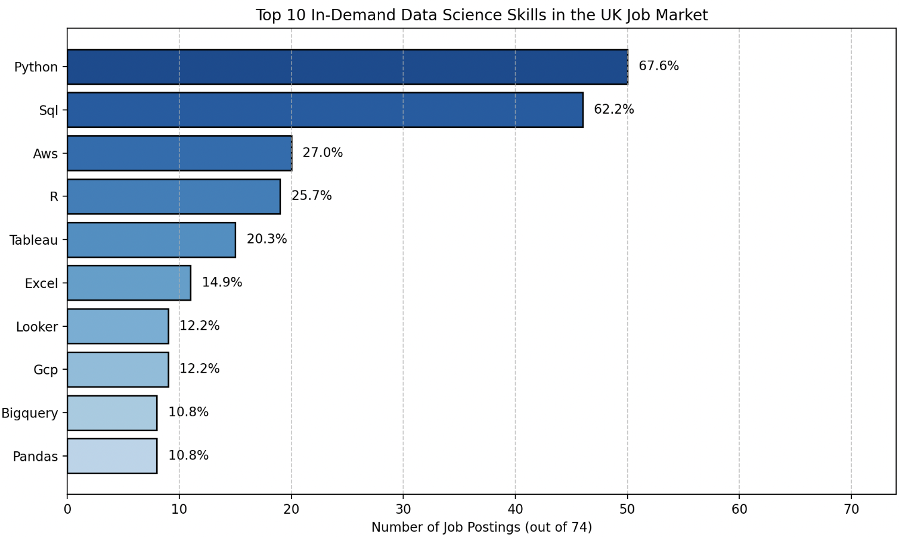

# Job Posting Analysis Project 

The project utilises a dataset containing detailed information about job postings, including job titles, company names, locations, salary ranges, and the required skillset. These files were analysed to identify trends in job demand, salary expectations, and geographic distribution of opportunities. The insights derived from this analysis aim to provide a comprehensive overview of the Data Science job market in 2023.

## Background

The databases used in this project was provided through __Luke Barousse__'s online resources - available via his website [here](https://www.lukebarousse.com/sql). 

## Project Goals

By querying the databases, this project ultimately sought answers to five questions concerning Data Science job postings: 

1. What are the highest-paying data scientist job postings in the UK? 
2. What are the skills most often required for the highest-paying job postings in the UK?
3. What are the top skills most sought after, among all data science jobs in the UK?
4. What are the average salaries for data science job postings requiring each skill in the UK? 
5. What are the optimal skills for data science job postings in the UK, in terms of both associated average salary, and demand? 

## Tools Used

The following software resources were required to answer these questions: 

- **PostgreSQL** was used as the relational database management system, to store and manage the data. 
- **SQL** was used to query and manipulate the data. 
- **pgAdmin 4** was the GUI by which the PostgreSQL database was interacted with.

## Results

The SQL written to answer these five questions can be found . 

### 1. What are the highest-paying data scientist job postings in the UK?

From `1_find_top_paying_jobs`, the top 50 data scientist roles by salary were fetched. The following table displays the top 10 of these, along with the company, job location and annual salary.

| Job ID  | Company Name              | Job Location                             | Average Yearly Salary (USD $) |
|---------|---------------------------|------------------------------------------|----------------------------|
| 565034  | Sanofi                    | Cambridge, UK                            | 205000                     |
| 401338  | Adarga                    | London, UK                               | 192000                     |
| 97173   | ZFX                       | London, UK                               | 192000                     |
| 743921  | Cambridge Epigenetix      | Little Chesterford, Saffron Walden, UK   | 166942                     |
| 201315  | Agilisys                  | London, UK                               | 166420                     |
| 431917  | Sanofi                    | Cambridge, UK                            | 165000                     |
| 1456281 | M-KOPA                    | London, UK                               | 158500                     |
| 103652  | Tractable                 | London, UK                               | 157500                     |
| 1029491 | C3.ai                     | London, UK                               | 157500                     |
| 456177  | GoCardless                | London, UK                               | 157500                     |

The largest salary stands at $205,000. 
The lowest of the top 50 salaries stands at $72,900. 

The median of the top 50 salaries is $112,360, while the mean average salary is 
£122,531.84. 

### 2. What are the skills most often required for the highest-paying job postings in the UK?

From `2_find_top_skills_highest_paying_jobs`, the most frequently required skills for the highest-paying 20 data scientist roles were identified. The analysis revealed that skills such as Python, Machine Learning, and SQL are consistently in high demand among these positions. The following visualisation provides a breakdown of the top skills required for the highest-paying roles:

Python emerges as the dominant required skill, while SQL appears as the distant 2nd.

### 3. What are the top skills most sought after, among all data science jobs in the UK?

In `3_find_top_skills_all_jobs`, the analysis identified the most commonly required skills across all data science job postings in the UK. The findings indicate that Python, SQL, and Machine Learning are the most frequently mentioned skills, followed by Data Analysis and Cloud Computing. The following visualisation illustrates the distribution of these top skills:

Once again, Python and SQL emerge as the dominant two skills. Additionally, skills in Amazon Web Services (AWS), R, Tableau and Excel appear as required skills in more than 20% of data science job postings in the UK.

### 4. What are the average salaries for data science job postings requiring each skill in the UK?

Using `4_find_avg_salary_per_skill`, the average salaries associated with each skill were calculated. The analysis revealed that certain skills, such as Scala and Word, are linked to higher average salaries compared to others. The following table displays the top 10 skills ranked by their associated average salaries:

| Skill     | Average Yearly Salary (USD $) |
|-----------|---------------------|
| Scala     | 205,000.00          |
| Word      | 165,000.00          |
| Redshift  | 165,000.00          |
| Java      | 157,500.00          |
| Windows   | 139,216.00          |
| Oracle    | 136,506.25          |
| Power BI  | 132,624.00          |
| Plotly    | 130,882.00          |
| GitHub    | 128,140.33          |
| Julia     | 128,020.75          |

Perhaps interestingly, SQL and Python aren't associated with the highest salaries. Rather, they are associated with jobs of an average salary of $110,272 and $111,928, respectively. 

The lowest-paying skills appear to be Matlab, OpenCV, Spring and Hadoop, each of which are associated with data science job postings in the UK with an average salary of $70,000 or less.

### 5. What are the optimal skills for data science job postings in the UK, in terms of both associated average salary, and demand?

Using `5_find_optimal_skills`, the analysis identified skills that strike a balance between high demand and high average salary. 

Th

## Conclusion